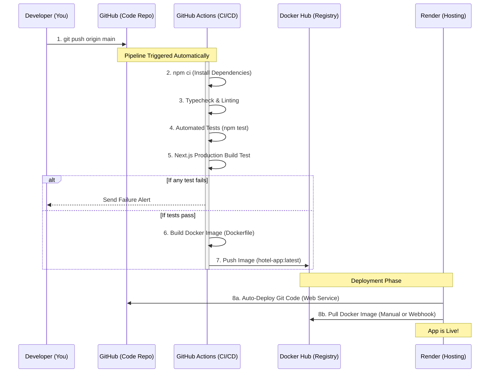

# Hotel QR Food Ordering System - Architecture & DevOps Flow

This document breaks down the entire system into two parts: the **Application Architecture** (how the code works) and the **DevOps Pipeline** (how the code gets deployed). You can use the diagrams and bullet points below to sketch out your notes and explain the project clearly.

## 1. Application Architecture

This project follows a modern, server-centric architecture using **Next.js (App Router)** and **Supabase**. It leverages "Zero-Trust" principles, meaning the server never trusts data calculated by the browser (like the total price of an order) and recalculates it securely in the database.

```mermaid
graph TD
    %% Define styles
    classDef client fill:#f59e0b,stroke:#b45309,stroke-width:2px,color:#fff;
    classDef server fill:#3b82f6,stroke:#1d4ed8,stroke-width:2px,color:#fff;
    classDef db fill:#10b981,stroke:#047857,stroke-width:2px,color:#fff;

    %% Nodes
    subgraph Client-Side (Browsers)
        C1[Customer Mobile Browser]:::client
        C2[Admin Dashboard / Staff]:::client
        C3[Kitchen Display System Tablet]:::client
    end

    subgraph Server-Side (Next.js 16)
        N1[Next.js Server Components]:::server
        N2[Server Actions / API Routes]:::server
    end

    subgraph Database Layer (Supabase)
        S1[(PostgreSQL Database)]:::db
        S2[Supabase Auth]:::db
        S3[Supabase Storage - Images]:::db
        S4[Supabase Realtime]:::db
    end

    %% Relationships
    C1 -- "QR Code / Browse Menu" --> N1
    C1 -- "Submit Order" --> N2
    C2 -- "Manage Menu/Tables" --> N2
    
    N1 -- "Fetch Data securely" --> S1
    N2 -- "Atomic RPC (e.g. create_order)" --> S1
    N2 -- "Verify session" --> S2
    
    S1 -- "Broadcast DB changes" --> S4
    S4 -- "WebSockets (Live Order Updates)" --> C3
    S4 -- "WebSockets (Live Status)" --> C1
    
    C2 -- "Upload Dish Photos" --> S3
```

### How to Explain the Application Architecture:
*   **The Frontend (Client):** Built with React/Tailwind. Customers scan a QR code to view the menu and place orders without registering. Staff use it to manage the restaurant, and the Kitchen uses it to see live incoming orders.
*   **The Backend (Next.js):** Instead of a separate Express/Node backend, Next.js handles server-side logic using **Server Actions**. This makes form submissions and data fetching incredibly fast and secure.
*   **The Database (Supabase):** Acts as the central brain.
    *   **PostgreSQL** stores tables, menus, and orders.
    *   **Realtime** uses WebSockets to instantly ping the Kitchen Display System (KDS) when a new order is inserted, without the user needing to refresh the page.
    *   **Auth & Storage** handle staff logins and dish images.

---

## 2. DevOps & CI/CD Pipeline

DevOps is the automated process of taking code from your laptop and safely deploying it to the internet. This project uses **GitHub Actions** for Continuous Integration/Continuous Deployment (CI/CD) and **Docker** for containerization.



### How to Explain the DevOps Pipeline:
When explaining this in an interview or notes, break it down into three phases:

1.  **Continuous Integration (The Checks):**
    *   When a developer writes new code (like fixing a bug) and pushes it to GitHub, **GitHub Actions** intercepts it.
    *   It creates a temporary server, installs the project, and runs quality checks: strict TypeScript typing, ESLint for code formatting, and automated tests.
    *   *Why?* This guarantees that a developer can never accidentally push broken code to production. If a test fails, the pipeline stops immediately.
2.  **Containerization (The Packaging):**
    *   Once the code passes the tests, the pipeline reads the `Dockerfile`.
    *   It packages the Next.js app, its dependencies, and a stripped-down Linux operating system into a single **Docker Image**.
    *   It uploads this image to **Docker Hub** (an image registry, like GitHub but for Docker containers).
    *   *Why?* Docker ensures that "if it works on my machine, it works anywhere." The container runs exactly the same on a Mac, Windows, or a cloud server.
3.  **Continuous Deployment (The Release):**
    *   Once the new image is ready on Docker Hub, the hosting provider (**Render**) can pull that image and restart the server, instantly serving the new version to end-users.
    *   Alternatively, Render can also deploy directly from the GitHub repository source code using Infrastructure as Code (`render.yaml`).
